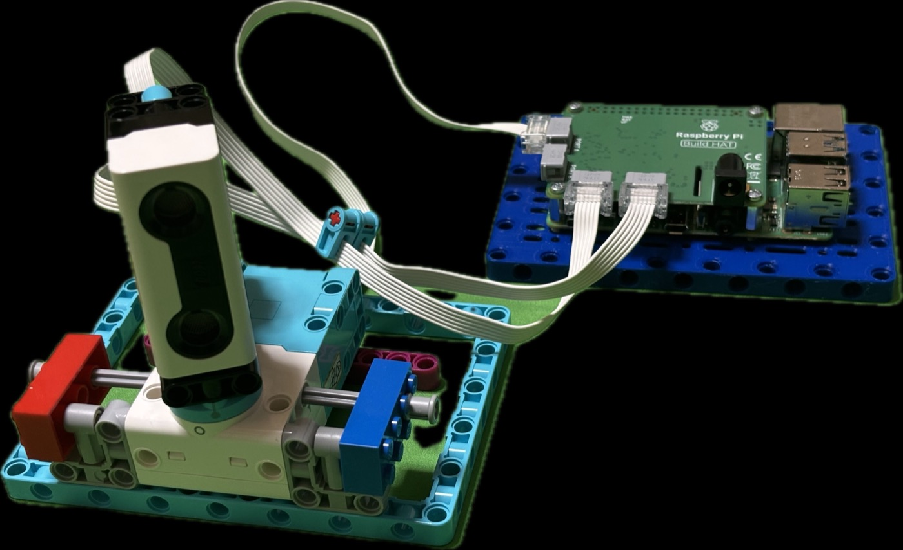

# libspikehat

C/Python library — transparently control LEGO SPIKE Prime devices via Raspberry Pi Build HAT.

[日本語版 README](README_ja.md)



## Overview

`libspikehat` is a shared library that directly implements the Raspberry Pi Build HAT serial protocol.
Both C and Python applications can control the same devices **through the same library** —
C apps link against it directly, Python apps use it via `ctypes`.

```
┌───────────────┐       ┌─────────────────────┐
│   C app        │       │   Python app         │
└──────┬────────┘       └──────────┬───────────┘
       │                           │ ctypes
       └────────────┬──────────────┘
              ┌─────▼──────────────────────┐
              │   libspikehat.so            │
              │  (Build HAT protocol impl)  │
              └─────┬──────────────────────┘
                    │ UART /dev/serial0 (115200 baud)
              ┌─────▼──────────────────────┐
              │        Build HAT            │
              └────────────────────────────┘
```

## Supported Devices

| Device | Constant | Features |
|--------|----------|----------|
| SPIKE Prime M Angular Motor | `SPIKEHAT_DEVICE_MOTOR_M` | PWM, speed control, position readout |
| SPIKE Prime L Angular Motor | `SPIKEHAT_DEVICE_MOTOR_L` | Same as above |
| SPIKE Prime Color Sensor | `SPIKEHAT_DEVICE_COLOR` | HSV value readout |
| SPIKE Prime Distance Sensor | `SPIKEHAT_DEVICE_DISTANCE` | Distance (mm) readout |
| SPIKE Prime Force Sensor | `SPIKEHAT_DEVICE_FORCE` | Force (N) and pressed state readout |

## Requirements

- Raspberry Pi 4
- [Raspberry Pi Build HAT](https://www.raspberrypi.com/products/build-hat/)
- **Raspberry Pi OS Bookworm (64-bit)** — see warning below
- `sudo apt install python3-build-hat` (for firmware loading)
- `gcc`, `cmake >= 3.15`

> **Warning: OS version (as of May 2026)**
>
> As of May 2026, the latest Raspberry Pi OS is **Trixie**, but
> `python3-build-hat` and the Build HAT firmware have only been verified on **Bookworm**.
> `python3-build-hat` is not available on Trixie, and this library will not work there.
> When using Raspberry Pi 4 + Build HAT, please use **Bookworm (Debian 12)**.

## Build

```bash
git clone https://github.com/kuboaki/libspikehat.git
cd libspikehat
mkdir build && cd build
cmake .. -DCMAKE_BUILD_TYPE=Release
make -j4
```

Build outputs:
- `build/libspikehat.so` — shared library
- `build/test_motor` — C sample (motor)
- `build/test_sensor` — C sample (sensor)

## First-Time Setup

The Build HAT firmware is managed by `python3-build-hat`.
Before using this library for the first time, follow these steps.

Install `python3-build-hat`:

```bash
sudo apt install python3-build-hat
```

Load the firmware onto the Build HAT (only needed once):

```bash
python3 -c "from buildhat import Motor"
```

This step is not required on subsequent runs.

## Usage in C

```c
#include "spikehat.h"

int main(void) {
    spikehat_t *hat = spikehat_open("/dev/serial0");

    // Port configuration (A=0, B=1, C=2, D=3)
    spikehat_port_config(hat, 0, SPIKEHAT_DEVICE_MOTOR_M);
    spikehat_port_config(hat, 3, SPIKEHAT_DEVICE_DISTANCE);
    sleep(1);

    // Motor: run at speed 50 for 3 seconds
    spikehat_motor_run_for_seconds(hat, 0, 3.0f, 50);

    // Distance sensor readout
    int mm;
    if (spikehat_distance_read(hat, 3, &mm) == 0)
        printf("Distance: %d mm\n", mm);

    spikehat_close(hat);
    return 0;
}
```

Compile:
```bash
gcc myapp.c -I/path/to/libspikehat/include \
    -L/path/to/libspikehat/build -lspikehat -lpthread \
    -Wl,-rpath,/path/to/libspikehat/build -o myapp
```

## Usage in Python

```python
import sys
sys.path.insert(0, '/path/to/libspikehat/python')
from spikehat import SpikeHat, DEVICE_MOTOR_M, DEVICE_DISTANCE

with SpikeHat() as hat:
    hat.port_config(0, DEVICE_MOTOR_M)
    hat.port_config(3, DEVICE_DISTANCE)

    hat.motor_run_for_seconds(0, 3.0, 50)
    print(f"Distance: {hat.distance_read(3)} mm")
```

## API Reference

### Initialization

| Function | Description |
|----------|-------------|
| `spikehat_open(device)` | Open the Build HAT. `device` is typically `"/dev/serial0"` |
| `spikehat_close(hat)` | Stop all devices and close |
| `spikehat_port_config(hat, port, type)` | Assign and initialize a device type on a port |

### Motor Control

| Function | Description |
|----------|-------------|
| `spikehat_motor_pwm(hat, port, power)` | Direct PWM control (-1.0 to +1.0) |
| `spikehat_motor_start(hat, port, speed)` | Start rotating at given speed (-100 to +100) |
| `spikehat_motor_run_for_seconds(hat, port, sec, speed)` | Run for specified seconds |
| `spikehat_motor_stop(hat, port)` | Stop (coast) |
| `spikehat_motor_coast(hat, port)` | Coast to stop |
| `spikehat_motor_get_speed(hat, port, *speed)` | Get current speed |
| `spikehat_motor_get_position(hat, port, *degrees)` | Get current position (degrees) |

### Sensors

| Function | Description |
|----------|-------------|
| `spikehat_distance_read(hat, port, *mm)` | Get distance in millimeters |
| `spikehat_color_read_hsv(hat, port, *h, *s, *v)` | Get color as HSV |
| `spikehat_force_read(hat, port, *force, *pressed)` | Get force (N) and pressed state |

## Project Structure

```
libspikehat/
├── include/spikehat.h      Public API header
├── src/
│   ├── serial.c/h          UART communication
│   ├── protocol.c/h        Build HAT text protocol
│   ├── spikehat.c          Initialization, reader thread, port management
│   ├── motor.c             Motor control implementation
│   └── sensor.c            Sensor readout implementation
├── python/spikehat.py      Python ctypes bindings
├── examples/
│   ├── test_motor.c/.py    Motor sample
│   └── test_sensor.c/.py   Sensor sample
└── CMakeLists.txt
```

## Protocol Notes

Communication with the Build HAT uses a text protocol over `/dev/serial0` (115200 baud, 8N1).
For protocol details, refer to `docs/protocol.md` in the
[raspberrypi/buildhat](https://github.com/raspberrypi/buildhat) repository.

## License

MIT License
