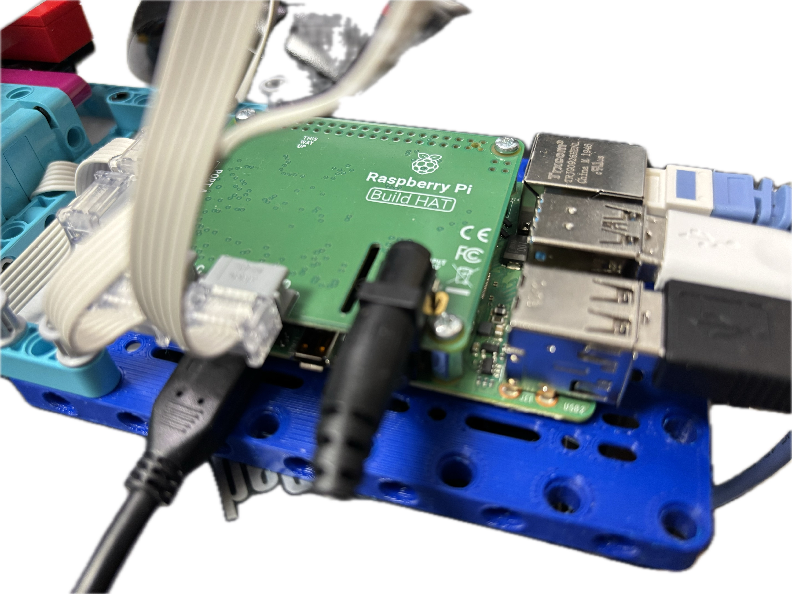
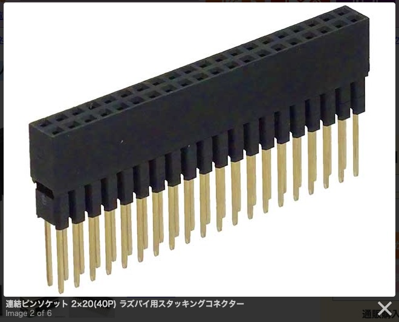
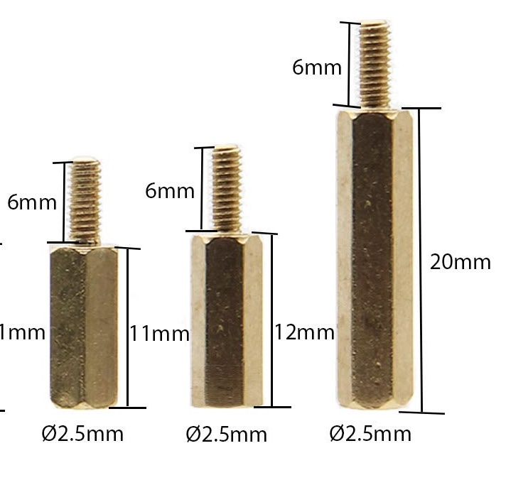
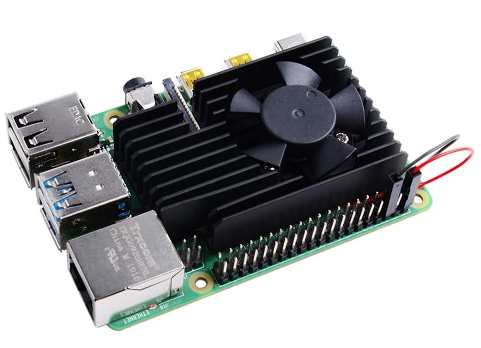
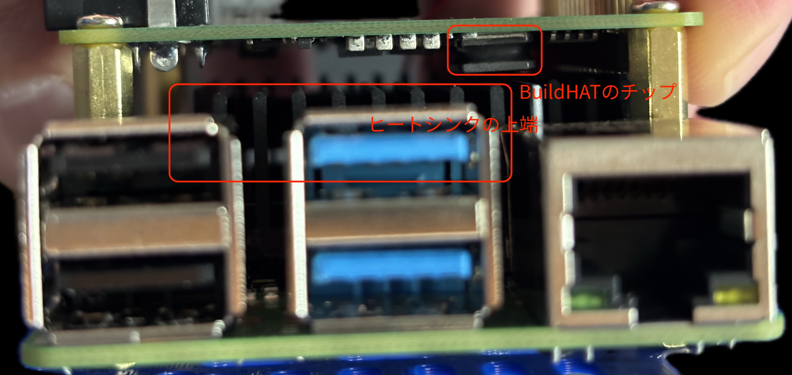
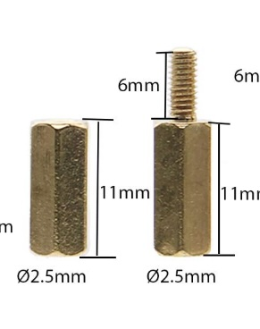
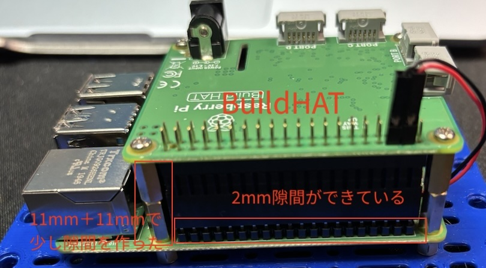

# Raspberry Pi 4 + Build HAT のヒートシンクファン冷却

Build HAT を装着した Raspberry Pi 4 に、ヒートシンク付き冷却ファンを取り付ける方法の紹介。

## 結論

Raspberry Pi 4 に対して、スタッキングコネクターでピンを延長し、22mm 分のスペーサーで
基板間隔を確保した上で Build HAT を取り付けると、間にできた空間にヒートシンク付き
ファンを装着できる。

## 動機

Raspberry Pi 4 のピンに Build HAT をそのまま装着すると、小さなヒートシンクしか
つけられない。2つの基板の間に狭い空間しか作れず、空気が循環しないため冷却が
十分ではなくなる。

長時間のデモを実行する場合、各チップの温度上昇が問題となる。また Build HAT も
Raspberry Pi のチップ群の発熱の影響を受けてしまう。これらを解消するために、
ヒートシンク付きファンを装着しつつ Build HAT も装着する方法を検討した。

## 手順

### 1. 初期状態: Build HAT をそのまま装着

Raspberry Pi にそのまま Build HAT を装着した状態。

負荷が小さいうちは問題なさそうだが、両方の基板がやや熱くなる。1日中デモを
動かす場合や、暑い部屋では熱暴走する可能性がある。そこでヒートシンクファンを
装着できないか検討した。

### 2. スタッキングコネクターで空間を確保

ラズパイ用スタッキングコネクター（連結ピンソケット 2×20, 40P）を挟むことで、
2つの基板の間に冷却ファン用の空間を作れると考えた。

これを2枚の基板の間に挟むと、20mm のスペーサーでちょうどよい高さになる。

### 3. ヒートシンク付き冷却ファンを選定

基板側に装着するタイプで、かつ基板の取り付け穴を塞がないタイプのヒートシンク
ファンが必要だった。そこで「GeeekPi ラズベリーパイ冷却キット」（Raspberry Pi 4
冷却ファン + アルミ製ヒートシンク、Raspberry Pi 3B+ / 3 / 2 Model B 対応）を購入した。

### 4. チップとヒートシンクの干渉が発覚

20mm スペーサーではスタッキングコネクターを挟んだ2枚の基板間にちょうどよい
距離だったが、実際に固定しようとしたところ、Build HAT 上のチップの一つが
ヒートシンクと干渉することが判明した。

### 5. 11mmスペーサー2個で基板間を22mmに変更

干渉を避けるため、20mm スペーサー1個の代わりに 11mm スペーサーを2個使い、
基板間隔を 22mm に広げた。

この 2mm 分、スタッキングコネクターは Raspberry Pi のピンから 2mm ほど
「浮いた」状態になる。ただしスペーサーで固定しているため接続は保たれ、
ぐらつきなどもない。

## まとめ

ファンとヒートシンクを装着しつつ、Build HAT も取り付けることに成功した。
ポイントは以下の2点。

- スタッキングコネクター（2×20, 40P）で基板間に空間を確保する
- 20mm スペーサーではチップとヒートシンクが干渉するため、11mm スペーサー
  2個で 22mm の間隔にする（コネクターが 2mm 浮くが強度上の問題はない）
